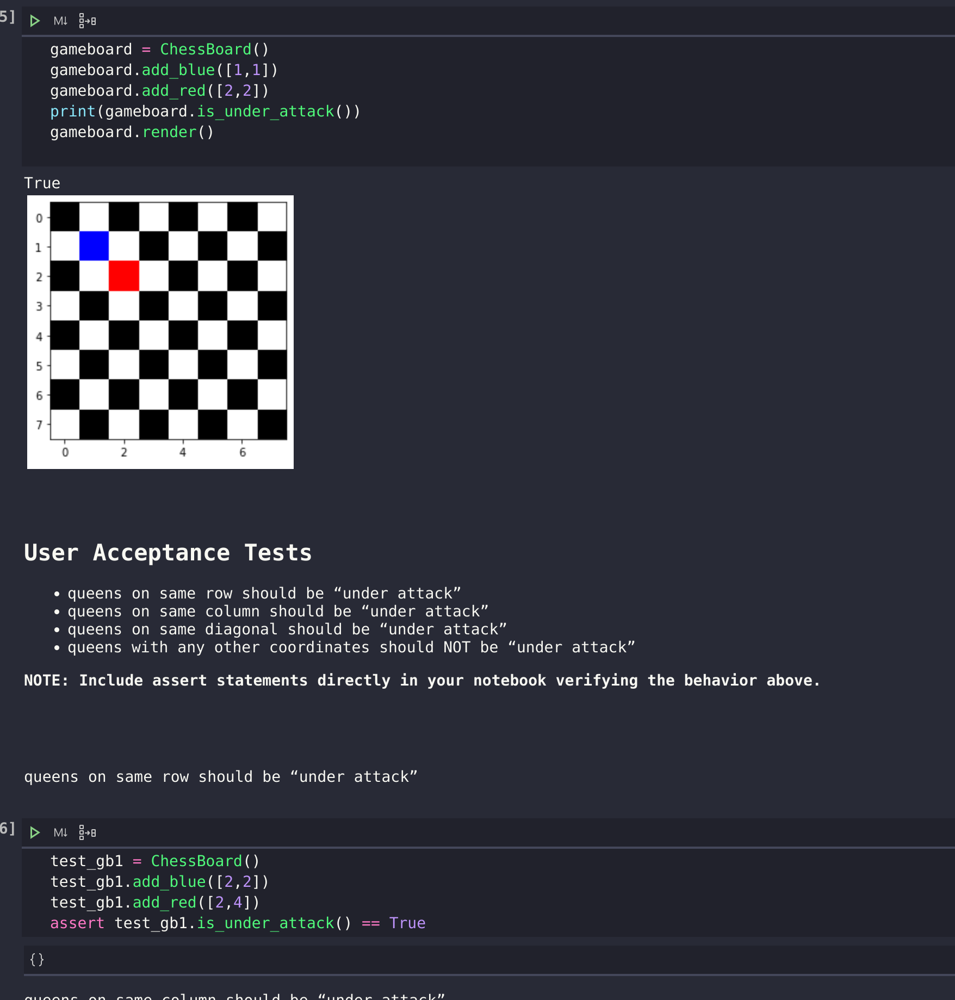

## Numpy chess board (Lab-11)
*Author: Lee-Roy King*

----

## Description
Today we’ll be constructing chess boards like it’s 1980.
No prebuilt images, just the power of arrays and pixel art.

---

### Visuals
***[Add screenshots of your application in action]***

#### Application Start

---

### Change Log
***[The change log will list any changes made to the code base. This includes any changes from TA/Instructor feedback]***  
1.0 : Created initial functionality